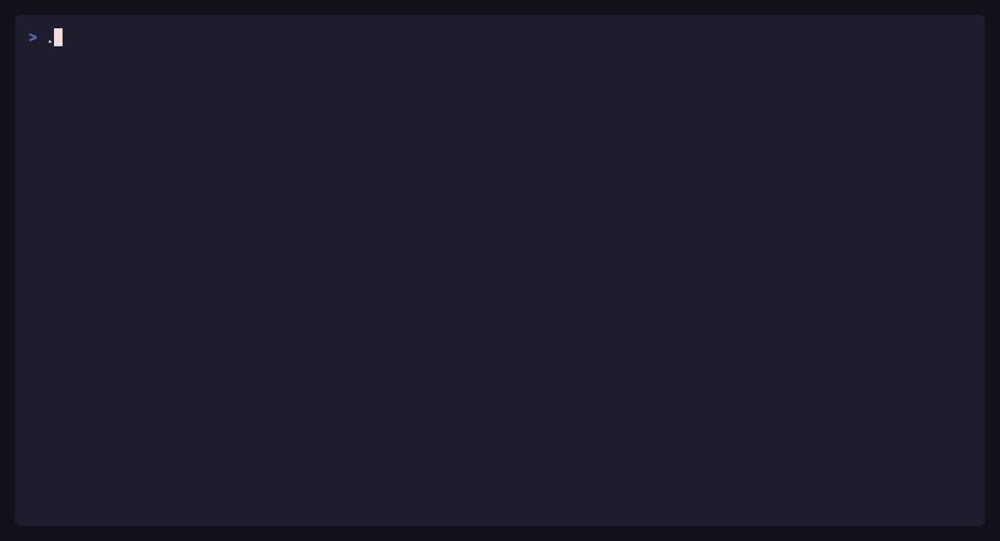

<p align="center">
  
</p>

<h1 align="center">Rustmux</h1>

<p align="center">
  <strong>A modern terminal workspace, built in Rust.</strong><br>
  Persistent sessions · Flexible panes · Kitty-native protocols
</p>

<p align="center">
  <a href="https://jacky-lzx.github.io/Rustmux/">Documentation</a> ·
  <a href="#quick-start">Quick start</a> ·
  <a href="#see-it-in-action">Demos</a> ·
  <a href="#development-tracks">Development tracks</a> ·
  <a href="CONTRIBUTING.md">Contributing</a>
</p>

<p align="center">
  <a href="https://github.com/Jacky-Lzx/Rustmux/actions/workflows/ci.yml"></a>
  <a href="https://github.com/Jacky-Lzx/Rustmux/actions/workflows/docs.yml"></a>
</p>

Rustmux brings together the continuity of persistent terminal sessions, a
[Zellij](https://zellij.dev/)-inspired modal interface, and modern terminal
protocols for applications such as Kitty and Yazi. Leave a workspace running,
return to it later, and keep your shells, editors, and tools close at hand.

**macOS and Linux · Stable Rust toolchain**

> [!WARNING]
> Rustmux is still at an early stage. Configuration and persistence formats may
> evolve. Windows is not currently supported.

## Quick start

```sh
git clone https://github.com/Jacky-Lzx/Rustmux.git
cd Rustmux
cargo run --release
```

To install the binary from the checkout:

```sh
cargo install --path .
rustmux
```

Rustmux creates or attaches to the `default` session. It starts in **locked**
mode, where input goes directly to your shell.

| First steps                       | Keys                                                                |
| --------------------------------- | ------------------------------------------------------------------- |
| Enter normal mode                 | <kbd>Ctrl-b</kbd>                                                   |
| Open contextual help              | <kbd>?</kbd> in normal mode                                         |
| Create a window                   | <kbd>c</kbd> in normal mode                                         |
| Split right / down                | <kbd>Ctrl-b</kbd> → <kbd>Ctrl-p</kbd> → <kbd>r</kbd> / <kbd>d</kbd> |
| Detach and leave programs running | <kbd>Ctrl-b</kbd> → <kbd>Ctrl-o</kbd> → <kbd>d</kbd>                |

Run `rustmux` again to reconnect, or `rustmux -s work` to create or attach to a
named session. See [Installation and Quick Start](docs/getting-started/quick-start.md)
for shell selection and configuration setup.

## See it in action

**Arrange your workspace.** Create and rename windows, split panes, rearrange
layouts, and zoom the active pane.


<details>
<summary><strong>Session Manager — browse, search, and switch</strong></summary>

Browse running and saved sessions. Press `/` to search, then Enter to open a
match or create a session when no name matches.



</details>

<details>
<summary><strong>History and help — find output and discover shortcuts</strong></summary>

Search scrollback, copy selections, and discover actions in the contextual help
overlay. Help shortcuts can also be executed directly from the overlay.


</details>

The demos are recorded from [reproducible VHS tapes](demos/README.md).

## Built for everyday terminal work

| Capability                     | What it gives you                                                                                                                                                                                                |
| ------------------------------ | ---------------------------------------------------------------------------------------------------------------------------------------------------------------------------------------------------------------- |
| **Persistent sessions**        | Detach without stopping programs. Save layouts, working directories, and optional scrollback for later restoration. [Sessions →](docs/guide/sessions.md)                                                         |
| **Flexible panes**             | Split, resize, move, zoom, and use floating terminals. Move panes across windows while preserving their running processes. [Windows and panes →](docs/guide/windows-panes.md)                                    |
| **History tools**              | Search output, copy with OSC 52, and open full history or the previous command's output in your editor. [History and copy →](docs/guide/history.md)                                                              |
| **Kitty and Yazi integration** | Graphics, extended keyboard input, file drag and drop, rich clipboard, file transfer, and notifications. Availability depends on the outer terminal. [Compatibility →](docs/reference/terminal-compatibility.md) |
| **A configurable interface**   | Modal shortcuts, themes, live configuration reloads, and attention indicators for panes that need you. [Configuration →](docs/configuration/index.md)                                                            |
| **Scriptable workspaces**      | Start project layouts, send input to specific panes, capture output, and save sessions from scripts. [Automation →](docs/guide/automation.md)                                                                    |

Each pane maintains its own terminal state, and rendering updates changed cells.
Session saves reuse unchanged pane history and format changed captures in the
background. See the [autosave performance report](docs/reference/autosave-performance.md)
for measurements and their limits.

## Development tracks

AI helped turn Rustmux from an idea into a usable tool. The project keeps room
for that exploration while building a version developed through the owner's
personal review and ongoing learning.

|                              | `main`                                                    | `main-human`                                 |
| ---------------------------- | --------------------------------------------------------- | -------------------------------------------- |
| Focus                        | Rapid exploration and feature development                 | Gradual implementation under personal review |
| Code                         | Human-written or AI-generated; largely AI-generated today | Human-written or AI-generated                |
| PR review                    | May be performed by AI                                    | Must be performed by the project owner       |
| Issue acceptance and closure | May be performed by AI                                    | Require the project owner's confirmation     |

`main-human` may use its own module structure, implementation, and commit history.
It does not need to copy `main` commit for commit. **Human review is the
requirement; human-only authorship is not.**

[Read the review policy and progress record →](docs/reference/development-tracks.md)

Feature coverage will count functionality that is implemented, verified, and
accepted by the owner against an agreed `main` baseline. That baseline has not
been established yet, so no completion percentage is claimed.

## Find your way around

| Start here                                           | Go further                                                       |
| ---------------------------------------------------- | ---------------------------------------------------------------- |
| [Core concepts](docs/getting-started/concepts.md)    | [Project layouts and script control](docs/guide/automation.md)   |
| [Keybindings and modes](docs/guide/keybindings.md)   | [Kitty and Yazi](docs/guide/kitty-yazi.md)                       |
| [Configuration](docs/configuration/index.md)         | [Themes](docs/configuration/themes.md)                           |
| [Troubleshooting](docs/reference/troubleshooting.md) | [Development, tests, and fuzzing](docs/reference/development.md) |

Read the [online documentation](https://jacky-lzx.github.io/Rustmux/) or browse
its [source in this repository](docs/index.md). Before opening an issue or PR,
read [Contributing](CONTRIBUTING.md) and choose the appropriate development track.

<details>
<summary><strong>Build the documentation locally</strong></summary>

With [mdBook](https://rust-lang.github.io/mdBook/) installed:

```sh
./scripts/build-docs.sh
mdbook serve --open
```

The build output is written to `dist/`. The preview rebuilds as you edit the
English documentation.

</details>
